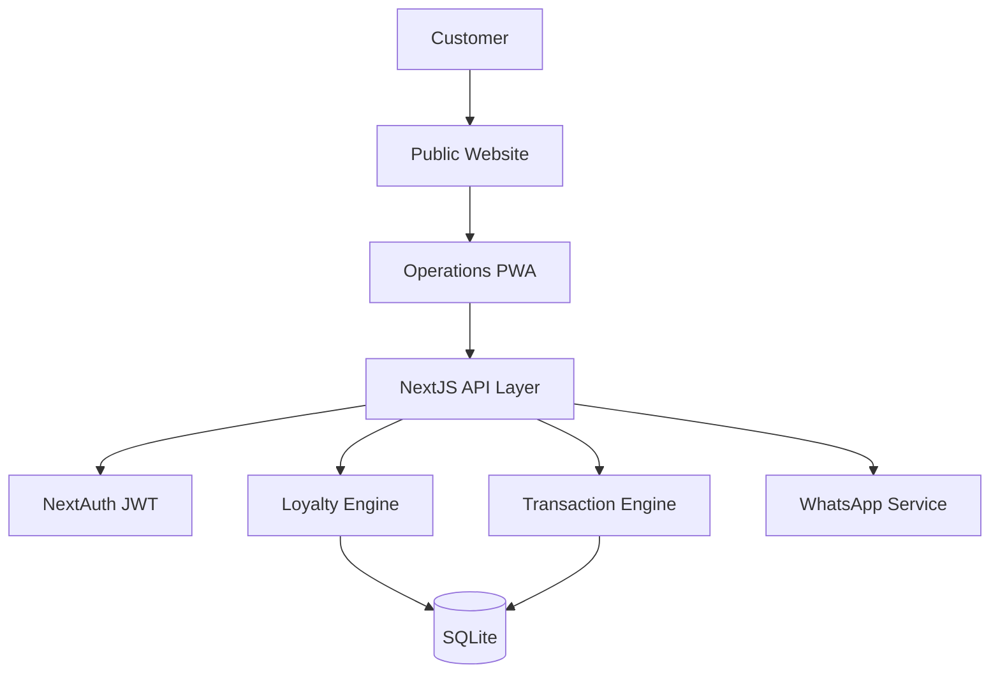
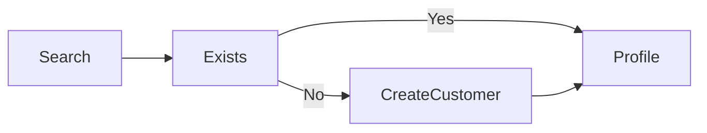
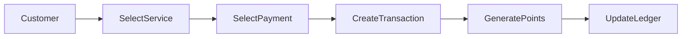
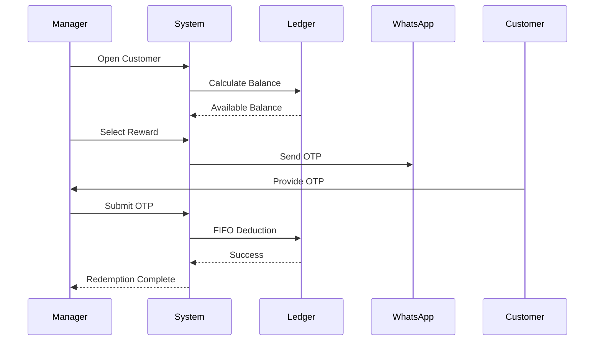
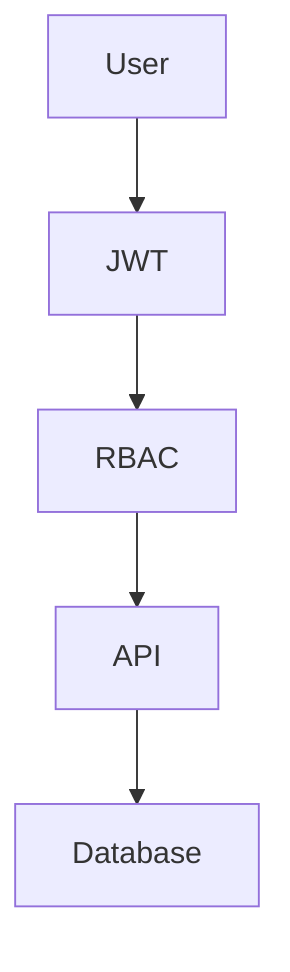
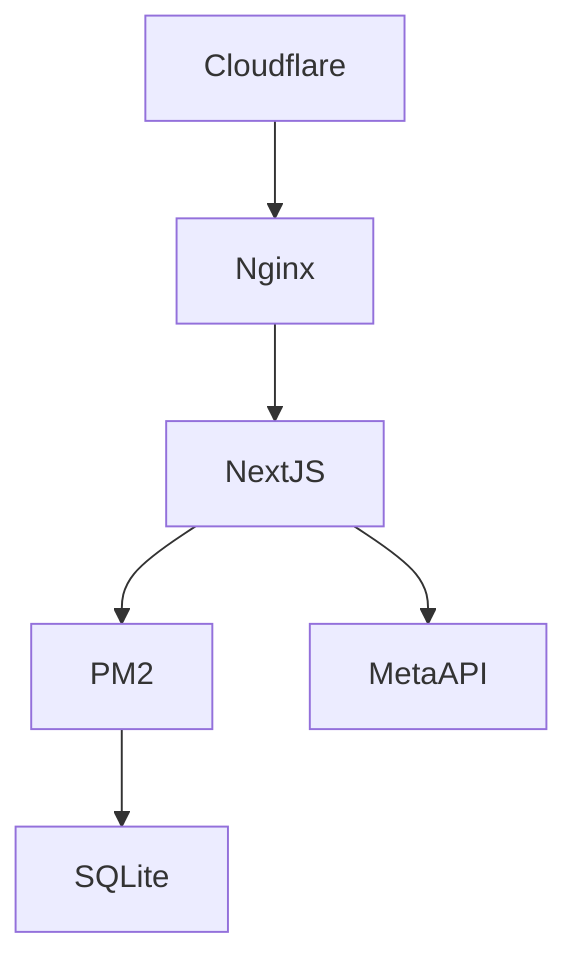

# Magma Autospa Loyalty & Operations Platform
## Product Requirements Document (PRD)

### Executive Summary
**Product Name:** Magma Autospa Loyalty & Operations Platform

**Product Type:** Customer Loyalty + Branch Operations Management Platform

### Target Users
- Customer
- Manager
- Branch Manager
- Corporate Admin
- System Admin

---

# Business Problem

Current challenges:
- No centralized customer database
- No loyalty management
- No redemption tracking
- No branch-wise visibility
- No audit trail
- No customer retention engine
- No expiry notification mechanism

---

# Success Metrics

## Revenue
- Revenue per Branch
- Revenue Growth %
- Average Ticket Size
- Repeat Visit Rate

## Loyalty
- Active Loyalty Members
- Redemption Rate
- Points Liability
- Customer Retention %

## Operations
- Daily Check-ins
- Service Utilization
- Branch Performance Ranking
- Manager Productivity

---

# High-Level Architecture

---

# Core Modules

## Customer Management
- Search Customer
- Create Customer
- Customer Profile
- Loyalty Balance
- History Timeline

### Workflow

---

## Service Transactions

---

## Loyalty Redemption

---

# Analytics Dashboard

### Revenue
- Daily Revenue
- Monthly Revenue
- Branch Revenue

### Loyalty
- Active Members
- Points Issued
- Points Redeemed

### Services
- Most Sold Services
- Most Redeemed Services

### Operational
- Check-ins Today
- Transactions Today
- Top Managers

---

# Security Architecture

Security Controls:
- HttpOnly Cookies
- JWT Rotation
- CSRF Protection
- Rate Limiting
- Audit Logging
- OTP Encryption
- HTTPS Only
- Database Backup

---

# Deployment Architecture

---

# Release Plan

## Phase 1 (8 Weeks)
- Authentication
- Customer Management
- Transactions
- Loyalty Engine
- Redemption
- OTP
- Analytics Dashboard

## Phase 2 (4 Weeks)
- Promotions
- Campaigns
- Birthday Rewards
- Referral Program
- WhatsApp Automation

## Phase 3 (8 Weeks)
- Multi-location Franchising
- Mobile App
- QR Loyalty Card
- AI Retention Engine
- Customer Self-Service Portal

---

# Recommended Next Documents

1. Complete ERD (100+ Entities)
2. Screen Inventory
3. API Specifications
4. Domain Model
5. Migration Strategy
6. Sequence Diagrams
7. Sprint Plan
8. Developer Implementation Bible
